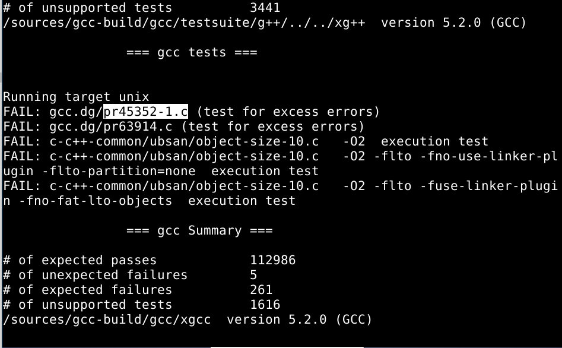
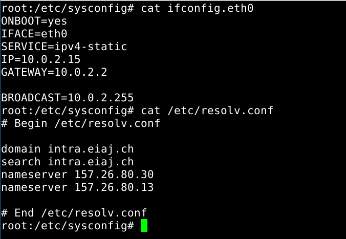

# LFS
Linux From Scratch Project

# Work Log

# Prerequisites
In order to share files between systems, the git program was used.

Problem with git.
```bash
WARNING: gnome-keyring:: couldn't connect to: /home/[user_name]/.cache/keyring-[generated_string]/pkcs11
```
Solutions found @ [Debian Forums](https://lists.debian.org/debian-user/2014/05/msg00070.html) & [Solved Programming Problems](http://hongouru.blogspot.ch/2012/07/solved-warning-gnome-keyring-couldnt.html)


# Part I - Introduction

## Chapter I
Just reading, nothing of note.

# Part II - Preparing for the Build

## Chapter II - Preparing a new Partition

### 1. Creating the empty partitions
In this chapter we need to create a new partition where the LFS Linux kernel will be located.

The **problem** : only have 1 partition and it's the bootable one.

**Solution** for VM : add a new harddrive of 12GB

Harddrive is located in /dev/sdb (port 2 SATA)
Run: 
```bash
cfdisk /dev/sdb
```
And then
1. add the 10240MB partition with
2. and the swap partition for the remaining 2GBs

This can also be done with gparted as it's simply much easier.

**Solution** for Ubuntu Laptop :

Reboot the machine with the Ubuntu USB stick inserted. Boot on the Live Ubuntu Image and get gparted. Resize to heart's content and follow the rest of the instructions (or just do everything with gparted).

[Source](http://askubuntu.com/questions/291888/can-i-adjust-reduce-my-partition-size-for-ubuntu)

### 2. Make file system:

In order to see the number of the partitions one must run:

```bash
fdisk -l
```

Then using the IDs of the partitions (The second harddrive is located on port 2 SATA so sdb):
```bash
mkfs -v -t ext4 /dev/sdb1
mkswap /dev/sdb5
```

After the filesystem has been created we setup an environment variable $LFS as such:
```bash
export LFS=/mnt/lfs
```

Setting this variable to another place (like `home/<user_name>`) should be avoided. 
All users should have read and write permissions to that place otherwise there will be issues afterwards.

This variable will be used to quickly retrive the path to the location of the mounted LFS ppartition.

Add the export within the .bashrc and /root/.bashrc by using 
```bash 
nano .bashrc
```

Without this change, the environment variable is forgotten when leaving the terminal.

Note: [What's the difference between .bashrc, .bash_profile, and .environment?](http://stackoverflow.com/questions/415403/whats-the-difference-between-bashrc-bash-profile-and-environment)

Note: [on ubuntu](https://help.ubuntu.com/community/EnvironmentVariables)

Also enabled colored terminal since was already here.
```bash
force_color_prompt=yes
```

### 3. Mounting the new partition

We make the partition accesible now by mounting it as an ext4 filetype.
```bash
sudo mkdir -pv $LFS
sudo mount -v -t ext4 /dev/sdb1 $LFS
```

The -p option from makedir creates the parents of the path. 
For example: /dir1/dir2/dir3, creates: dir1, then /dir1/dir2 then /dir1/dir2/dir3

## Chapter III - Packages and Patches
In this chapter the sources needed to build a linux kernel are downloaded.
The sources are located within the [wget-list.txt file](ftp://ftp.lfs-matrix.net/pub/lfs/lfs-packages/7.8/wget-list)
but the repository also contains the list itself.

Create the sources directory and set the write and sticky modes on that directory:
```bash
mkdir -v $LFS/sources
chmod -v a+wt $LFS/sources
```
Download all sources by using the wget-list.txt provided by the LFS author/team with the following command:
```bash
wget --input-file=wget-list --continue --directory-prefix=$LFS/sources
```
The packages were also posted on [Github](https://github.com/Drakesinger/LFS-7.8-Packages). 
Downloading them from git would probably require the LFS git as some of the files are larger than 50mb.

Just run :
```bash
git clone https://github.com/Drakesinger/LFS-7.8-Packages.git sources
```

## Chapter IV - Final Preparations
In this chapter we create a directory for the installation of temporary tools used to compile our kernel 
and we add an unprivileged user with a personal environment to reduce the risk of hurting our host system.

### 1. The Tools directory

As **root**, create the tools directory and a symbolic link to it on the host system.
```bash
sudo mkdir -v $LFS/tools
sudo ln -sv $LFS/tools /
```

### 2. The *lfs* user
Next we add the *lfs* user so that no pain may arrive when doing the rest of the actions.

```bash
sudo groupadd lfs
sudo useradd -s /bin/bash -g lfs -m -k /dev/null lfs
```

Now we need that *lfs* user to have a password:
```bash
sudo passwd lfs
```

And we grant it full access rights to tools and sources (he'll need it).

```bash
chown -v lfs $LFS/tools
chown -v lfs $LFS/sources
```

Now we login as the *lfs* user:
```bash
su - lfs
```

### 3. The *lfs* user's environment

Run the following commands to set up the environment:
```bash
cat > ~/.bash_profile << "EOF"
exec env -i HOME=$HOME TERM=$TERM PS1='\u:\w\$ ' /bin/bash
EOF
```
```bash
cat > ~/.bashrc << "EOF"
set +h
umask 022
LFS=/mnt/lfs
LC_ALL=POSIX
LFS_TGT=$(uname -m)-lfs-linux-gnu
PATH=/tools/bin:/bin:/usr/bin
export LFS LC_ALL LFS_TGT PATH
EOF
```
```bash
source ~/.bash_profile
```
## Chapter V - Constructing a Temporary System
### Q) What is a toolchain?

### A) Compiler + Assembler + Linker + Libraries

In order to determine the working platform we can run the script located within the binutils tarball called `config.guess`.
The result on my VM is:
```bash
$ ./config.guess
i686-pc-linux-gnu
```

To determine the platform's dynamic linker run the following:
```bash
$ echo 'int main(){}' > dummy.c
$ gcc dummy.c 
$ ls
a.out  dummy.c
$ readelf -l a.out | grep interpreter
      [Requesting program interpreter: /lib/ld-linux.so.2]
```

**Note** Added the $ to diferentiate input from output.

For the rest of this chapter, just follow the instruction in the book.

In case it is not clear (it isn't sometimes), for each sub-chapter (aka. package) you do the following:
1. Untar it: `tar -xf <package_name>.tar.xz`
2. Go into the extracted folder: `cd <package_name>`
3. Follow the rest of the instructions.
4. Once done, go back to the sources directory: `cd ..`
5. Remove the extracted files: `rm -r <package_name>`

**Note** I have not encountered any problems during this chapter.

Once the stripping has been done (I have not done it) you change users again.

Exit the *lfs* user's shell by entering:
```bash
exit
```
And change the ownership back to root:
```bash
chown -R root:root $LFS/tools
```

# Part III - Building the LFS System
## Chapter VI - Installing Basic System Software

## 1. Preparing Virtual Kernel File Systems
### 1. Directories where the file systems will be mounted
```bash
mkdir -pv $LFS/{dev,proc,sys,run}
```
### 2. Device nodes
```bash
mknod -m 600 $LFS/dev/console c 5 1
mknod -m 666 $LFS/dev/null c 1 3
```
### 3. Mounting and populating /dev
```bash
mount -v --bind /dev $LFS/dev
```
### 4. Remaining virtual kernel filesystems:
```bash
mount -vt devpts devpts $LFS/dev/pts -o gid=5,mode=620
mount -vt proc proc $LFS/proc
mount -vt sysfs sysfs $LFS/sys
mount -vt tmpfs tmpfs $LFS/run
```
## 2. Package Management
No package manager is installed. 

## 3. Entering the Chroot environment

We now enter a different root environment that is populated with the temporary tools only:
```bash
chroot "$LFS" /tools/bin/env -i \
HOME=/root \
TERM="$TERM" \
PS1='\u:\w\$ ' \
PATH=/bin:/usr/bin:/sbin:/usr/sbin:/tools/bin \
/tools/bin/bash --login +h
```

If one ever quits this environment, run the command again.

The bash prompt will indicate that this user has no name. 
This will be fixed later after the `passwd` and `group` files are created is installed.

## 4. Creating Directories
```bash
mkdir -pv /{bin,boot,etc/{opt,sysconfig},home,lib/firmware,mnt,opt}
mkdir -pv /{media/{floppy,cdrom},sbin,srv,var}
install -dv -m 0750 /root
install -dv -m 1777 /tmp /var/tmp
mkdir -pv /usr/{,local/}{bin,include,lib,sbin,src}
mkdir -pv /usr/{,local/}share/{color,dict,doc,info,locale,man}
mkdir -v /usr/{,local/}share/{misc,terminfo,zoneinfo}
mkdir -v /usr/libexec
mkdir -pv /usr/{,local/}share/man/man{1..8}
case $(uname -m) in
x86_64) ln -sv lib /lib64
ln -sv lib /usr/lib64
ln -sv lib /usr/local/lib64 ;;
esac
mkdir -v /var/{log,mail,spool}
ln -sv /run /var/run
ln -sv /run/lock /var/lock
mkdir -pv /var/{opt,cache,lib/{color,misc,locate},local}
```

## 5. Creating Essential Files and Symlinks
```bash
ln -sv /tools/bin/{bash,cat,echo,pwd,stty} /bin
ln -sv /tools/bin/perl /usr/bin
ln -sv /tools/lib/libgcc_s.so{,.1} /usr/lib
ln -sv /tools/lib/libstdc++.so{,.6} /usr/lib
sed 's/tools/usr/' /tools/lib/libstdc++.la > /usr/lib/libstdc++.la
ln -sv bash /bin/sh

ln -sv /proc/self/mounts /etc/mtab
```

Create the passwd file:
```bash
cat > /etc/passwd << "EOF"
root:x:0:0:root:/root:/bin/bash
bin:x:1:1:bin:/dev/null:/bin/false
daemon:x:6:6:Daemon User:/dev/null:/bin/false
messagebus:x:18:18:D-Bus Message Daemon User:/var/run/dbus:/bin/false
nobody:x:99:99:Unprivileged User:/dev/null:/bin/false
EOF
```

And the groups:
```bash
cat > /etc/group << "EOF"
root:x:0:
bin:x:1:daemon
sys:x:2:
kmem:x:3:
tape:x:4:
tty:x:5:
daemon:x:6:
floppy:x:7:
disk:x:8:
lp:x:9:
dialout:x:10:
audio:x:11:
video:x:12:
utmp:x:13:
usb:x:14:
cdrom:x:15:
adm:x:16:
messagebus:x:18:
systemd-journal:x:23:
input:x:24:
mail:x:34:
nogroup:x:99:
users:x:999:
EOF
```

Now run the shell againm this will allow user name and group name resolution to work since the files have been set up:
```bash
exec /tools/bin/bash --login +h
```

In order for some programs, login, agetty and init to write their log files, those files need to exist:
```bash
touch /var/log/{btmp,lastlog,wtmp}
chgrp -v utmp /var/log/lastlog
chmod -v 664 /var/log/lastlog
chmod -v 600 /var/log/btmp
```

For the rest of this chapter, just follow the instructions from the book.
Some of the packages however, had some changes we needed to do in order for our swiss french virtual linux machine.

## Packages with modifications or installed without testsuite confirmation:

* ## Glibc Locales used:
    ```bash
    localedef -i fr_CH -f UTF-8 fr_CH.UTF-8
    localedef -i fr_CH -f ISO-8859-1 fr_CH
    ```
    Everything else is the same.

* ## GCC

    The GCC compiler has been installed following the instructions in the book.
    The test results are located [here](.\Captures\GCC Testsuite Summary-details.txt).
    Comparing with the results of the testsuite ran by the GCC team shows that the failed tests are not really problematic.
    
    Failed tests:
    
    

* ## Shadow configuration
    
    * left <code>GROUP=999</code> by default
    * Changed CREATE_MAIL_SPOOL=no
        using: <code>sed -i 's/yes/no/' /etc/default/useradd</code>

* ## Libtool-2.4

* ## Inetutils-1.9.4
 
* ## Perl
 
* ## Autoconf
 
* ## Automake
 
* ## Diffutils
 
* ## GetText
 
* ## Gperf
 
* ## GROFF

    Configured with the following:
    ```bash
    PAGE=A4 ./configure --prefix=/usr
    ```

* ## XZ-5.2.1

	Problem after installation.
	```bash
	ln -svf ../../lib/$(readlink /usr/lib/liblzma.so) /usr/lib/liblzma.so
	```
	However, after some study (and using <code> ls -lFahH --color </code>):

	The symbolic link /usr/lib/liblzma.so will point to

	```bash
	lrwxrwxrwx  1 root root    26 Mar  7 16:29 liblzma.so -> ../../lib/liblzma.so.5.2.1*
	```

	/lib is the root, may have been easier to point directly to /lib insted of ../../lib.
    This is made in case the user does not exist?

	Looks like acctually all symbolic links to libraries not in the user use the same type of paths.

* ## Kmod Problem

    Last symbolic link could not be created. Tried to remake the package -> failure. had to restore back to a previous image.
    After rebuilding and modifying everything from the Autoconf tool, everything works.

* ## Eudev

    Command to update hardware device info:
    ```bash
    LD_LIBRARY_PATH=/tools/lib udevadm hwdb --update
    ```
    Needs to be run after every hardware update

## Chapter 7 - System Configuration

### Managing Devices

Nothing was done to deal with duplicate devices nor insertable USBs.

### General Network Configuaration

Following the book, the following configuration has been used:
```bash
cat > /etc/sysconfig/ifconfig.eth0 << "EOF"
ONBOOT=yes
IFACE=eth0
SERVICE=ipv4-static
IP=192.168.1.2
GATEWAY=192.168.1.1
PREFIX=24
BROADCAST=192.168.1.255
EOF
```

The /etc/resolv.conf file was configured using the data from the host machine.

To configure the resolv.conf file run the following:
```bash
cat > /etc/resolv.conf << "EOF"
# Begin /etc/resolv.conf
domain <Your Domain Name>
nameserver <IP address of your primary nameserver>
nameserver <IP address of your secondary nameserver>
# End /etc/resolv.conf
EOF
```
However, it was modified as in the following screenshot to be in accord with the network at school:



In order to share stuff between the debian machine and everything else I set up git.
The IP address of the virtual machine was wrong and had to renew the lease.
Done with:
```bash
$ sudo dhclient -r eth0
$ sudo dhclient eth0
```

The system hostname has been configured using:
```bash
echo "mutdeb" > /etc/hostname
```

The hosts file has not been set up as no address resolutions had to be done.

### Configuring Sysvinit

Just following the book:
```bash
cat > /etc/inittab << "EOF"
# Begin /etc/inittab
id:3:initdefault:
si::sysinit:/etc/rc.d/init.d/rc S
l0:0:wait:/etc/rc.d/init.d/rc 0
l1:S1:wait:/etc/rc.d/init.d/rc 1
l2:2:wait:/etc/rc.d/init.d/rc 2
l3:3:wait:/etc/rc.d/init.d/rc 3
l4:4:wait:/etc/rc.d/init.d/rc 4
l5:5:wait:/etc/rc.d/init.d/rc 5
l6:6:wait:/etc/rc.d/init.d/rc 6
ca:12345:ctrlaltdel:/sbin/shutdown -t1 -a -r now
su:S016:once:/sbin/sulogin
1:2345:respawn:/sbin/agetty --noclear tty1 9600
2:2345:respawn:/sbin/agetty tty2 9600
3:2345:respawn:/sbin/agetty tty3 9600
4:2345:respawn:/sbin/agetty tty4 9600
5:2345:respawn:/sbin/agetty tty5 9600
6:2345:respawn:/sbin/agetty tty6 9600
# End /etc/inittab
EOF
```

### Configuring the system clock

The Virtual Machine has not been rebooted in some time and the hardware clock was very different than the system clock.
Seeing as the command:
```bash
hwclock --localtime -show
```
Did not return a value that was accurate to the system clock it means that the hwclock was set to UTC.
To configure the clock I did:
```bash
cat > /etc/sysconfig/clock << "EOF"
# Begin /etc/sysconfig/clock
UTC=1
# Set this to any options you might need to give to hwclock,
# such as machine hardware clock type for Alphas.
CLOCKPARAMS=
# End /etc/sysconfig/clock
EOF
```

No clockparams as it was simply not clear from the manual page what to enter there.

### **Configuring the linux console**

**The worst part of the whole book.**

This is the part where documentation is simply **abysmal** and hard to read.
Setup of the linux console keymap is complicated since the host machine runs debian and the manual pages for
`dumpkeys` / `keymaps` / `loadkeys` all point to a location that is not valid on a debian system.

Trying to find out the font used by the bash console points 
to the `usr/share/connsole-setup/console-setup` file:
```bash
CHARMAP=guess

CODESET=guess
FONTFACE=TerminusBold
FONTSIZE=16
```

So our font is Terminus.

Now we need to determine the keymaps.

After trying to read the documentation and getting a headache I gave up. 
Honestly, this is one of the worst documentation I have ever seen.
Trying to retrieve the charset of the current console, the font used, the keymaps is simply stupid and un-doable.

So the following was done:
1. Get all the keymaps on the host system:
```bash
dumpkeys > backup.kmap
```
This file can be loaded with `loadkeys`
2. Instead of using that keymap file I configured the console as such:
```bash
cat > /etc/sysconfig/console << "EOF"
# Begin /etc/sysconfig/console
UNICODE="1"
KEYMAP="qwertz/fr_CH"
FONT="lat2-16 -m 8859-15"
# End /etc/sysconfig/console
EOF
```
    **Notes**

    * KEYMAP: The keymaps are located on the lfs system in `/usr/share/keymaps/i386/`. 
    Here I have chosen the correct layout but without `latin-1` support (which was a mistake).
    If the keymap is not correct (it isn't, but I didn't change it), I can always go back and use that keymap dump instead of the official keymap.
    
    * FONT: no idea, cannot determine from the Terminus font readme which should be used and the [Francophone HOW-TO](http://www.tldp.org/HOWTO/Francophones-HOWTO-5.html#ss5.4) is simply impossible to read.

    

### The rc.site File

The sysconfig/rc.site configuration used:
```bash
DISTRO="LFS-10-Mars-2016" # The distro name
DISTRO_CONTACT="horiamut@msn.com" # Bug report address
DISTRO_MINI="LFS-10-Mars-2016" # Short name used in filenames for distro config

[...]

# Write out fsck progress if yes
VERBOSE_FSCK=yes
```

The locales used (should change to english and eradicate the french language, it's simply horrible):
```bash
root:/etc# LC_ALL=fr_CH.iso88591 locale charmap
ISO-8859-1
root:/etc# LC_ALL=fr_CH.iso88591 locale language
French
root:/etc# LC_ALL=fr_CH.iso88591 locale int_curr_symbol
CHF
root:/etc# LC_ALL=fr_CH.iso88591 locale int_prefix     
41
root:/etc#
```
The profile language:
```bash
cat > /etc/profile << "EOF"
# Begin /etc/profile
export LANG=fr_CH.ISO-8859-1
# End /etc/profile
EOF
```

No inputrc file was created.

The shells file that contains a list of the login shells available on the system:
```bash
cat > /etc/shells << "EOF"
# Begin /etc/shells
/bin/sh
/bin/bash
# End /etc/shells
EOF
```

## Chapter 8 - Making the LFS System Bootable

### File System Table
The FSTAB file was configured as such:
```bash
cat > /etc/fstab << "EOF"
# Begin /etc/fstab
# file system / mount-point / filesystem type / options / dump / fsck
# order
/dev/sdb1   /               ext4            defaults                1   1
/dev/sdb5   swap            swap            pri=1                   0   0
proc        /proc           proc            nosuid,noexec,nodev     0   0
sysfs       /sys            sysfs           nosuid,noexec,nodev     0   0
devpts      /dev/pts        devpts          gid=5,mode=620          0   0
tmpfs       /run            tmpfs           defaults                0   0
devtmpfs    /dev            devtmpfs        mode=0755,nosuid        0   0
/dev/sr0    /media/cdrom0   udf,iso9660     user,noauto             0   0
# End /etc/fstab
EOF
```

### Kernel Compilation and Installation

```bash
make mrproper
make defconfig

make menuconfig
CONFIG_LOCALVERSION="LFS-Horia-Mut-10-Mar-16"

make
```

The Module load order:
```bash
install -v -m755 -d /etc/modprobe.d
cat > /etc/modprobe.d/usb.conf << "EOF"
# Begin /etc/modprobe.d/usb.conf
install ohci_hcd /sbin/modprobe ehci_hcd ; /sbin/modprobe -i ohci_hcd ; true
install uhci_hcd /sbin/modprobe ehci_hcd ; /sbin/modprobe -i uhci_hcd ; true
# End /etc/modprobe.d/usb.conf
EOF
```

### Using GRUB to Set Up the Boot Process

No rescue boot disk has been done. 
There wasn't any need for one since there are plenty of images of the virtual machine done for backup.

There is no way to actually read the grub.cfg file without spending too much time over it, 
so just following the book's instructions and the fact that our LFS disk is on a 
harddisk on sata port 2 we can just start configuring GRUB.
Install the GRUB files.
```bash
grub-install /dev/sdb
```

Create the GRUB configuration file:
```bash
cat > /boot/grub/grub.cfg << "EOF"
# Begin /boot/grub/grub.cfg
set default=0
set timeout=5
insmod ext2
set root=(hd1,1)
menuentry "GNU/Linux, Linux 4.2-lfs-7.8 by Mut Horia" {
linux /boot/vmlinuz-4.2-lfs-7.8 root=/dev/sdb1 ro
}
EOF
```

## Chapter 9 - The End

```bash
cat > /etc/lsb-release << "EOF"
DISTRIB_ID="Linux From Scratch"
DISTRIB_RELEASE="7.8"
DISTRIB_CODENAME="LFS by Horia Mut"
DISTRIB_DESCRIPTION="Linux From Scratch"
EOF
```

Reboot, press F12, chose the 2nd disk. GRUB will automatically load the new kernel and it's components.
